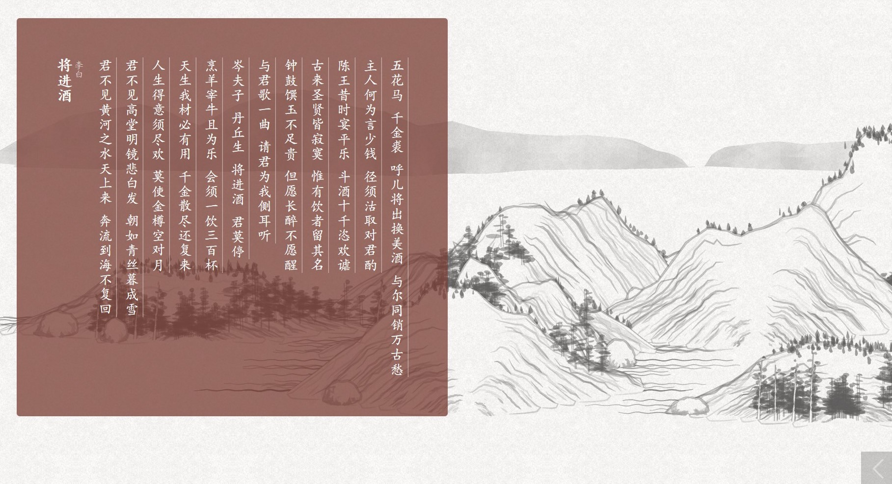

# poetry-source
## 展示


## 全唐诗
#### 来源
+ 郑州大学-全唐诗库(ZZU_JSON_chs) http://www3.zzu.edu.cn/qts/
+ 中国哲学书电子化计划(CText_JSON_cht) https://ctext.org/quantangshi/

#### 示例
```json
  {
    "volume": 18,
    "sequence": 53,
    "title": "橫吹曲辭：關山月",
    "author": "李白",
    "content": [
      "明月出天山，蒼茫雲海間。長風幾萬里，吹度玉門關。",
      "漢下白登道，胡窺青海灣。由來征戰地，不見有人還。",
      "戍客望邊色，思歸多苦顏。高樓當此夜，歎息未應閑。"
    ]
  }
```
```json
  {
    "volume": 18,
    "sequence": 53,
    "title": "横吹曲辞·关山月",
    "author": "李白",
    "content": [
      "明月出天山，苍茫云海间。",
      "长风几万里，吹度玉门关。",
      "汉下白登道，胡窥青海湾。",
      "由来征战地，不见有人还。",
      "戍客望边色，思归多苦颜。",
      "高楼当此夜，叹息未应闲。"
    ]
  }
```

## 幽梦影

#### 示例
```json
  {
    "content": "情之一字，所以维持世界；才之一字，所以粉饰乾坤。",
    "comment": [
      "吴雨若曰：世界原从情字生出，有夫妇，然后有父子；有父子，然后有兄弟；有兄弟，然后有朋友；有朋友，然后有君臣。",
      "释中洲曰：情与才缺一不可。"
    ]
  }
```

## 诗经
#### 示例
```json
  {
    "title": "关雎",
    "chapter": "国风",
    "section": "周南",
    "content": [
      "关关雎鸠，在河之洲。窈窕淑女，君子好逑。",
      "参差荇菜，左右流之。窈窕淑女，寤寐求之。",
      "求之不得，寤寐思服。悠哉悠哉，辗转反侧。",
      "参差荇菜，左右采之。窈窕淑女，琴瑟友之。",
      "参差荇菜，左右芼之。窈窕淑女，钟鼓乐之。"
    ]
  }
```